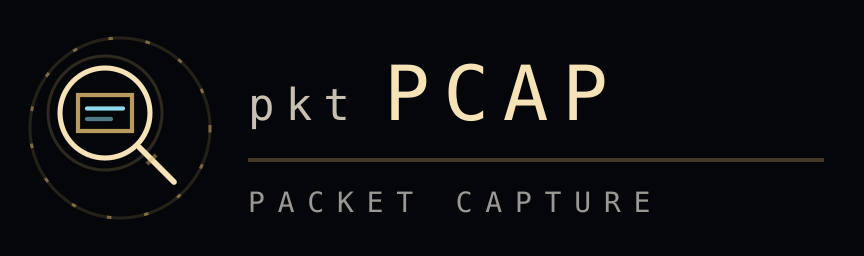

# pktPCAP

<p align="center">
  
</p>

<p align="center">
  A standalone Python/Flask web service for analyzing PCAP files in the browser, with AI-powered triage and a live NetFlow feed.
</p>

---

## Overview

pktPCAP is a locally-hosted packet capture analyzer. Drop a `.pcap` or `.pcapng` file onto the UI and get instant, rule-based analysis of TCP health, DNS, threats, and traffic flows — no cloud upload required. Optional AI analysis (Anthropic or OpenAI) layers natural-language findings on top of the parsed data.

**Key traits:**
- Runs entirely on localhost — captures never leave your machine
- Works without an API key (rule-based analysis only)
- Three analysis modes: Specific Issue, Auto-Triage, Security Review
- In-app log viewer, user management, SSL support, and a live pcapng feed endpoint

---

## Data Flow

pktPCAP supports two capture delivery modes: **local file upload** and **remote live capture**. Both paths ultimately produce a pcapng byte stream that the browser parses and analyzes.

---

### Mode 1 — Local File Analysis

The simplest path. You already have a capture file.

```
┌──────────────────────────────────────────────────────────────────┐
│  Your Machine                                                    │
│                                                                  │
│  [.pcap / .pcapng file]                                          │
│         │                                                        │
│         ▼ drag-and-drop / file picker                            │
│  [Browser — index.html]                                          │
│         │                                                        │
│         ├─ parsePcap() ──► JS packet parser (pure client-side)   │
│         │                  builds flows, TCP stats, DNS, threats  │
│         │                                                        │
│         ├─ Rule engine ──► anomaly detection (no server needed)  │
│         │                                                        │
│         └─ POST /api/ai ─► [pktPCAP Flask server]                │
│                                  │                               │
│                                  ▼                               │
│                     [Anthropic / OpenAI API]  (optional)         │
│                                  │                               │
│                                  ▼                               │
│                         AI findings panel                        │
└──────────────────────────────────────────────────────────────────┘
```

**What happens step by step:**

1. User drops a `.pcap` or `.pcapng` file on the browser UI.
2. The browser reads the file entirely client-side — bytes never leave the machine via the network.
3. `parsePcap()` in `index.html` walks every packet record and builds in-memory data structures: flow tuples, TCP flag counters, DNS query tables, and threat indicators.
4. Rule-based analysis runs immediately in the browser — no server round-trip needed.
5. If an AI key is configured, the browser POSTs the parsed summary to `/api/ai`. The Flask server proxies the request to Anthropic or OpenAI and returns the model's response.
6. Results are rendered across seven analysis tabs.

**Server role in local mode:** the Flask server is only involved for the AI proxy (`/api/ai`) and serving static files. Packet parsing is entirely client-side.

---

### Mode 2 — Remote Live Capture (Live Feed)

Use this when you want to capture traffic on a remote host and analyze it without physically moving a file.

```
┌──────────────────────────────────────────────────────────────────────────────┐
│  Remote Capture Host                                                         │
│                                                                              │
│  NIC / tap ──► [tshark]                                                      │
│                  │  raw pcapng bytes on stdout                               │
│                  │  (-w - flag writes to stdout instead of a file)           │
│                  ▼                                                           │
│               [curl]                                                         │
│                  │  HTTP POST, chunked transfer encoding                     │
│                  │  Authorization: Bearer <feed-token>                       │
│                  │  Content-Type: application/octet-stream                   │
└──────────────────┼───────────────────────────────────────────────────────────┘
                   │  (network — LAN or VPN tunnel)
                   ▼
┌──────────────────────────────────────────────────────────────────────────────┐
│  pktPCAP Host                                                                │
│                                                                              │
│  POST /api/feed/<session-name>                                               │
│         │                                                                    │
│         ├─ Bearer token validated against feed_token in DB                   │
│         │                                                                    │
│         ├─ FeedSession.append() ─► in-memory ring buffer (200 MB cap)        │
│         │   (thread-safe, chunked 64 KB reads from request.stream)           │
│         │                                                                    │
│         └─ Session stays "connected" until curl closes the connection        │
│                                                                              │
│  GET /api/feeds                 ─► list active sessions + bytes buffered     │
│  GET /api/feeds/<name>/download ─► download buffered pcapng as a file        │
│  DELETE /api/feeds/<name>       ─► clear and remove session                  │
│                                                                              │
│  [User loads buffered capture in UI] ──► same parse/analysis path as Mode 1 │
└──────────────────────────────────────────────────────────────────────────────┘
```

**What happens step by step:**

1. User retrieves the feed token from **Settings → Live Feed Token**.
2. On the remote capture host, `tshark` captures packets on the chosen interface and writes raw pcapng to stdout.
3. The output is piped to `curl`, which streams it as an HTTP POST to the pktPCAP feed endpoint.
4. pktPCAP validates the Bearer token and appends incoming chunks to a named `FeedSession` buffer (up to 200 MB; bytes beyond the cap are silently dropped and `truncated` is flagged).
5. While the feed is active, `GET /api/feeds` shows session status and byte count.
6. When capture is complete (or at any point), the user clicks **Load from Feed** in the UI, which fetches the buffered bytes and runs the same client-side parse/analysis as Mode 1.
7. The session can be cleared with `DELETE /api/feeds/<name>` to free memory.

---

### Remote Collector — Software & Configuration

The remote capture host needs only two tools: **tshark** and **curl**. Both are available on Linux, macOS, and Windows.

#### tshark

tshark is the command-line interface to Wireshark. It handles raw packet capture, decoding, and pcapng output.

| Package | Install |
|---|---|
| Debian / Ubuntu | `sudo apt install tshark` |
| RHEL / CentOS | `sudo yum install wireshark-cli` |
| macOS (Homebrew) | `brew install wireshark` |
| Windows | Wireshark installer includes tshark |

**Key flags used in the feed pipeline:**

| Flag | Purpose |
|---|---|
| `-i <interface>` | Network interface to capture on (e.g., `eth0`, `en0`) |
| `-w -` | Write pcapng output to stdout instead of a file |
| `-f "<filter>"` | BPF capture filter — limits what gets captured |
| `-s <bytes>` | Snap length — truncates packets to N bytes (reduce bandwidth) |
| `-b filesize:<MB>` | *(optional)* rotate buffer when used standalone |

**Listing available interfaces:**
```bash
tshark -D
```

#### curl

curl handles the HTTP transport to pktPCAP. The `--data-binary @-` flag tells curl to read the POST body from stdin, enabling the pipe.

#### Feed command (generic template)

```bash
tshark -i <interface> -w - | curl -s \
  -H "Authorization: Bearer <feed-token>" \
  -H "Content-Type: application/octet-stream" \
  --data-binary @- \
  "http://<pktpcap-host>:<port>/api/feed/<session-name>"
```

Replace:
- `<interface>` — capture interface name (see `tshark -D`)
- `<feed-token>` — token from pktPCAP Settings page
- `<pktpcap-host>` — hostname or IP of the machine running pktPCAP
- `<port>` — pktPCAP port (default `8765`)
- `<session-name>` — alphanumeric label for this capture session (e.g., `edge-fw-20260628`)

**With a BPF filter (capture only HTTP and DNS):**
```bash
tshark -i eth0 -f "port 80 or port 443 or port 53" -w - | curl -s \
  -H "Authorization: Bearer <feed-token>" \
  -H "Content-Type: application/octet-stream" \
  --data-binary @- \
  "http://<pktpcap-host>:8765/api/feed/my-session"
```

**With snap length (first 256 bytes of each packet — reduces bandwidth):**
```bash
tshark -i eth0 -s 256 -w - | curl -s \
  -H "Authorization: Bearer <feed-token>" \
  -H "Content-Type: application/octet-stream" \
  --data-binary @- \
  "http://<pktpcap-host>:8765/api/feed/my-session"
```

**HTTPS (if pktPCAP has SSL enabled):**
```bash
tshark -i eth0 -w - | curl -s -k \
  -H "Authorization: Bearer <feed-token>" \
  -H "Content-Type: application/octet-stream" \
  --data-binary @- \
  "https://<pktpcap-host>:8765/api/feed/my-session"
```

(`-k` skips cert verification for self-signed certs; use `--cacert <cert.pem>` for proper validation.)

#### Running as a background service (Linux systemd)

To run the feed continuously and restart automatically:

**`/etc/systemd/system/pktpcap-feed.service`:**
```ini
[Unit]
Description=pktPCAP Live Feed — <interface>
After=network.target

[Service]
Type=simple
ExecStart=/bin/bash -c 'tshark -i <interface> -w - | curl -s \
  -H "Authorization: Bearer <feed-token>" \
  -H "Content-Type: application/octet-stream" \
  --data-binary @- \
  "http://<pktpcap-host>:<port>/api/feed/<session-name>"'
Restart=on-failure
RestartSec=5s
User=<capture-user>

[Install]
WantedBy=multi-user.target
```

> **Note:** on Linux, tshark requires either `root` or a user in the `wireshark` group with `dumpcap` setuid permissions. Run `sudo dpkg-reconfigure wireshark-common` (Debian/Ubuntu) or `sudo usermod -aG wireshark <user>` and log out/in.

**Enable and start:**
```bash
sudo systemctl daemon-reload
sudo systemctl enable pktpcap-feed
sudo systemctl start pktpcap-feed
sudo systemctl status pktpcap-feed
```

---

### Feed Session Lifecycle

```
tshark starts → POST /api/feed/<name> opens → session.connected = True
                                                    │
                               data flows in chunks (64 KB reads)
                                                    │
tshark stops → curl closes connection → session.connected = False
                                                    │
                               buffer persists in memory until:
                               - user loads it in the UI
                               - DELETE /api/feeds/<name>
                               - server restart
```

Buffer limit is **200 MB per named session**. If the stream exceeds this, the session's `truncated` flag is set and additional bytes are discarded. Monitor usage via `GET /api/feeds`.

---

## Features

| Feature | Description |
|---|---|
| File analysis | Parse `.pcap` / `.pcapng` up to 500 MB (configurable) |
| Seven analysis tabs | Summary, Anomalies, Flows, TCP, UDP, DNS, Threats |
| AI assistant | Anthropic Claude or OpenAI GPT — proxied through the local server |
| Three analysis modes | Specific Issue · Auto-Triage · Security Review |
| Live feed | Remote `tshark`/Wireshark hosts can stream pcapng directly to the server |
| In-app log viewer | SQLite ring-buffer of app logs, queryable from the Logs page |
| User management | Create/edit/delete local users with password reset |
| SSL/HTTPS | Optional self-signed or custom cert via Settings |
| Settings UI | Web UI at `/settings` — no config file editing needed |
| Portable | All paths resolve relative to `server.py`; works from any directory |

---

## Requirements

- Python 3.10+
- pip packages: `flask>=3.0`, `anthropic>=0.40`, `openai>=1.50`
- Windows 10/11 (PowerShell screenshot helper) — core analysis works on any OS

---

## Setup

### 1. Clone

```bash
git clone https://github.com/bsnwgit/pktpcap.git
cd pktpcap
```

### 2. Install dependencies

```bash
pip install -r service/requirements.txt
```

### 3. Run

```bash
cd service
python server.py
```

The app opens at **http://localhost:8765** by default.

### 4. Add an API key (optional)

Go to **http://localhost:8765/settings** and enter your Anthropic or OpenAI API key. Without a key the rule-based parser still works — only the AI assistant panel requires one.

---

## Deployment (Windows — persistent service)

A `deploy-to-apps.bat` script copies the `service/` directory to `C:\apps\pktpcap\` and a `start.bat` is placed there for easy launching.

```
deploy-to-apps.bat          ← run after any code change to sync service/ → C:\apps\pktpcap\
C:\apps\pktpcap\start.bat   ← launch the server (pip install + python server.py)
```

To start automatically on login, enable the **"Start on login"** toggle in Settings. This writes a `pktpcap.bat` shortcut to `%APPDATA%\Microsoft\Windows\Start Menu\Programs\Startup\` using `pythonw` (no console window).

---

## Configuration

All settings are stored in a SQLite database (`pktpcap.db`). A minimal `config.json` in `service/` tells the server which database to use — it is never committed.

**`config.json` schema:**

```json
{
  "db_type": "sqlite",
  "db_path": "pktpcap.db"
}
```

Settings managed via the UI (`/settings`):

| Key | Default | Description |
|---|---|---|
| `port` | `8765` | Listening port |
| `provider` | `anthropic` | AI provider (`anthropic` or `openai`) |
| `anthropic_key` | — | Anthropic API key |
| `anthropic_model` | `claude-opus-4-8` | Model string |
| `openai_key` | — | OpenAI API key |
| `openai_model` | `gpt-4o` | Model string |
| `ssl_enabled` | `false` | Enable HTTPS |
| `ssl_cert` / `ssl_key` | — | Paths to cert/key files |
| `storage_path` | — | Where uploaded captures are saved |
| `max_upload_mb` | `500` | Upload size limit |
| `storage_quota_gb` | `50` | Total storage cap |
| `retention_days` | `90` | Auto-delete captures older than N days |
| `auto_purge` | `false` | Enable automatic retention enforcement |

---

## Usage

### Analyzing a capture file

1. Open **http://localhost:8765**
2. Drag-and-drop a `.pcap` or `.pcapng` file onto the upload zone, or click to browse
3. Choose an analysis mode:
   - **Specific Issue** — describe a known problem; AI focuses on it
   - **Auto-Triage** — AI scans for anything suspicious
   - **Security Review** — security-focused analysis
4. Click **Run Auto-Triage** (or **Analyze Captures** for specific issue mode)
5. Results appear across seven tabs — scroll with the `‹` / `›` arrows if not all are visible

### Analysis tabs

| Tab | Contents |
|---|---|
| **Summary** | Packet count, duration, data size, protocol breakdown, top talkers |
| **Anomalies** | HIGH-severity rule-based findings (RST rate, retransmissions, etc.) |
| **Flows** | All conversation flows with packet/byte counts and stream viewer |
| **TCP** | Health counters — RSTs, retransmissions, zero-window events, problem streams |
| **UDP** | Large datagrams, one-sided flows, high-rate flows |
| **DNS** | Query summary — names, record types, response codes |
| **Threats** | Security findings — port scans, cleartext HTTP, credential risk, and more |

### Live feed (remote capture)

pktPCAP can receive a live pcapng stream from a remote host running `tshark` or Wireshark. The server buffers up to 200 MB per named session.

**On the remote host:**

```bash
tshark -i eth0 -w - | curl -s \
  -H "Authorization: Bearer <feed-token>" \
  -H "Content-Type: application/octet-stream" \
  --data-binary @- \
  "http://<pktpcap-host>:8765/api/feed/<session-name>"
```

Retrieve the feed token from the Settings page, then load the buffered capture from the UI.

---

## API Reference

All endpoints are served from `http://localhost:8765`.

### Settings

| Method | Path | Description |
|---|---|---|
| `GET` | `/api/settings` | Return current settings (API keys masked after first 8 chars) |
| `POST` | `/api/settings` | Save settings; masked key values (containing `•`) are not overwritten |

### AI

| Method | Path | Description |
|---|---|---|
| `POST` | `/api/ai` | Proxy a prompt + data array to the configured AI provider |
| `POST` | `/api/ai/test` | Test the active API key ("Say PONG") |

**`POST /api/ai` body:**

```json
{
  "prompt": "Analyze these flows for signs of lateral movement",
  "data": [{ "type": "text", "text": "..." }]
}
```

### Database config

| Method | Path | Description |
|---|---|---|
| `GET` | `/api/db-config` | Return current DB config |
| `POST` | `/api/db-config/test` | Test a proposed DB connection |
| `POST` | `/api/db-config` | Save DB config |

### Users

| Method | Path | Description |
|---|---|---|
| `GET` | `/api/users` | List all users |
| `POST` | `/api/users` | Create a user |
| `PUT` | `/api/users/<id>` | Update a user |
| `DELETE` | `/api/users/<id>` | Delete a user |
| `POST` | `/api/users/<id>/reset-password` | Reset a user's password |

### Logs

| Method | Path | Description |
|---|---|---|
| `GET` | `/api/logs` | Query app logs (supports `?level=`, `?logger=`, `?limit=`, `?offset=`) |
| `GET` | `/api/logs/stats` | Log count by level and logger |
| `DELETE` | `/api/logs` | Clear all logs |
| `POST` | `/api/logs/level?level=DEBUG` | Change the live capture log level |

### Server

| Method | Path | Description |
|---|---|---|
| `POST` | `/api/restart` | Graceful server restart (spawns new process, exits after 0.8 s) |
| `POST` | `/api/save-image` | Save a base64 PNG data-URL to `screenshots/` |

---

## Project structure

```
pktpcap/
├── service/                    ← Canonical source (what gets deployed)
│   ├── server.py               ← Flask entry point
│   ├── db.py                   ← SQLite database layer
│   ├── logging_handler.py      ← SQLite async log ring-buffer
│   ├── requirements.txt
│   ├── config.json             ← Runtime config — GITIGNORED
│   ├── static/
│   │   └── index.html          ← Full single-page app
│   └── templates/
│       └── settings.html       ← Settings UI
├── deploy-to-apps.bat          ← Sync service/ → C:\apps\pktpcap\
├── favicon.ico / icon-*.png    ← App icons
├── lockup-*.png / lockup.svg   ← Logo assets
├── pktpcap.html                ← Original standalone artifact (pre-Flask)
└── PROJECT_CONTEXT.md          ← Extended developer notes
```

---

## Architecture notes

**Path resolution:** `BASE = Path(__file__).parent` throughout — the server resolves all paths relative to `server.py`, so it works identically from `service/` and `C:\apps\pktpcap\`.

**AI proxy:** The frontend calls `localAsk(prompt, dataArray)` which POSTs to `/api/ai`. The server forwards the request to Anthropic or OpenAI and streams the response back. API keys never leave the host.

**Log capture:** A background daemon thread drains a `queue.Queue` of log records into the `app_logs` SQLite table. The ring buffer is capped at 10,000 rows; oldest rows are purged on each flush cycle.

**Server restart:** `POST /api/restart` spawns `subprocess.Popen([sys.executable] + sys.argv)`, then calls `os._exit(0)` after 0.8 s. The new process is ready before the old one exits — the browser reconnects automatically.

**API key masking:** `GET /api/settings` returns keys as `sk-ant-api0•••...`. `POST /api/settings` skips overwriting a field if the submitted value contains a `•` character, preventing accidental key erasure.

---

## Supported AI models

| Provider | Models |
|---|---|
| Anthropic | `claude-opus-4-8`, `claude-sonnet-4-6`, `claude-haiku-4-5-20251001` |
| OpenAI | `gpt-4o`, `gpt-4o-mini`, and any model name you enter manually |

---

## Known issues

| Issue | Notes |
|---|---|
| `/api/save-image` path | In some deployments saves to `C:\apps\screenshots\` instead of `C:\apps\pktpcap\screenshots\` — `BASE.parent` path resolution bug |
| PowerShell screenshot | `PrintWindow`-based capture is unreliable on multi-monitor setups; use `html2canvas` on `.main` instead |

---

## Git workflow

Changes go to a feature branch — never directly to `main`. PRs are opened on both GitHub and GitLab for review before merging.

| Remote | URL |
|---|---|
| GitHub | https://github.com/bsnwgit/pktpcap |
| GitLab | https://gitlab.com/robert.barnett/pktpcap |

---

## License

Internal tool — Vyne Dental Security Operations.
